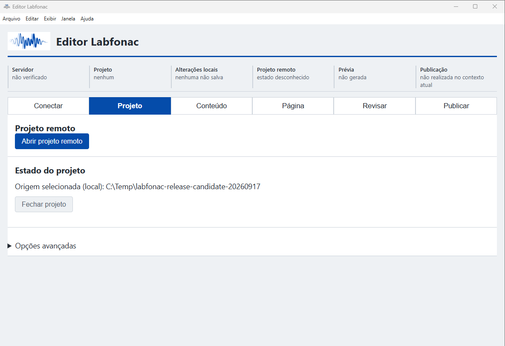
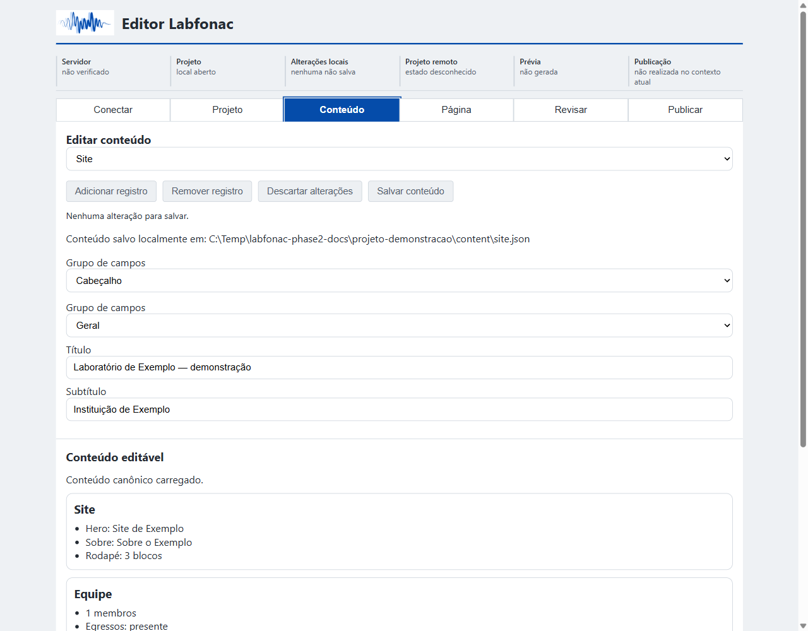
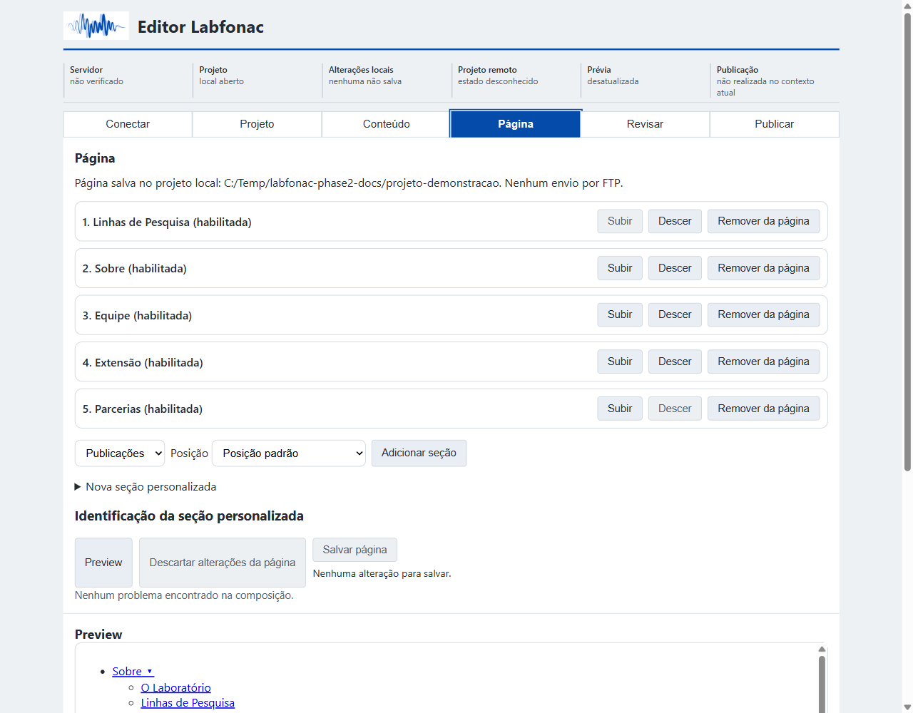
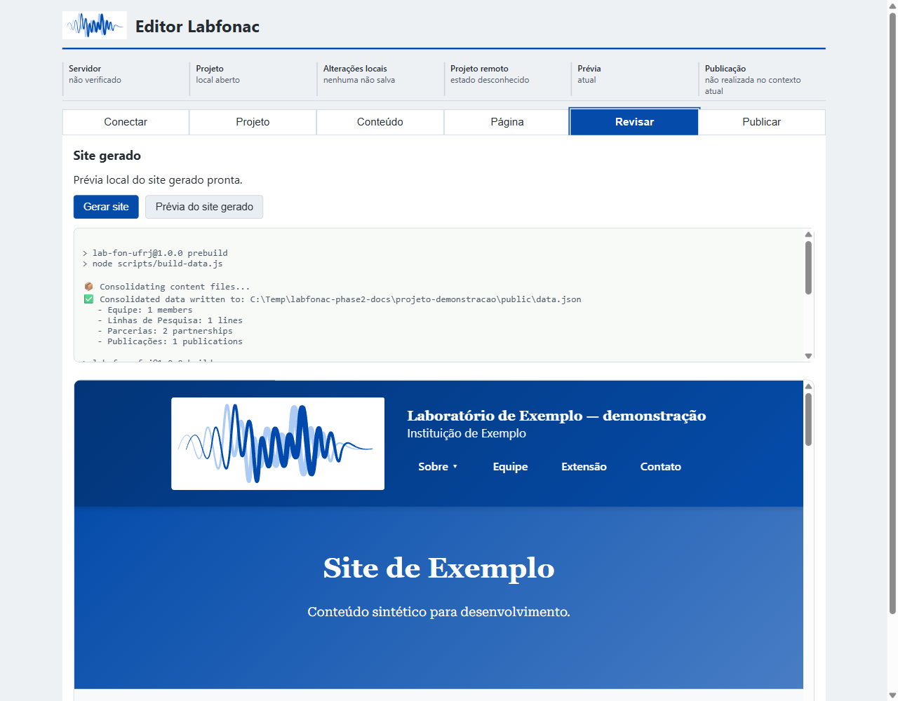
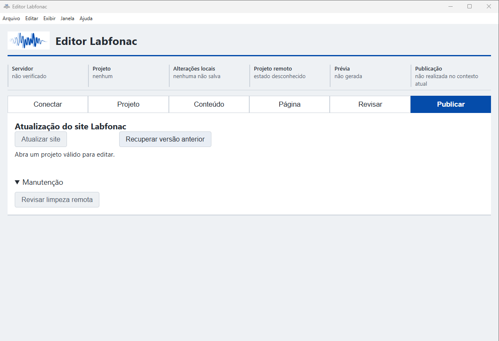

# Guia do Usuário do Editor Labfonac

## 1. O que é o Editor Labfonac

Ferramenta de manutenção do site do Laboratório de Fonética Acústica - UFRJ. Requer um projeto compatível com o fluxo de trabalho do laboratório e, para publicação, acesso a um servidor configurado para esse projeto.

O Editor permite abrir o projeto remoto, editar e salvar conteúdo, revisar e atualizar o site. Faça a manutenção pelos controles do aplicativo; não é necessário editar JSON ou usar um cliente FTP. Concepção e desenvolvimento: Wisley Vilela. Financiamento: PPGLEV/UFRJ. Software sob a MIT License.

Este guia descreve o fluxo pós-v1 aceito em 2026-10-03, não uma nova versão instalada. O instalador publicado v1.0.0 é anterior a esse fluxo; confirme com o responsável técnico qual distribuição foi validada para utilizá-lo. Em **Ajuda → Sobre o Editor Labfonac**, consulte a versão e os links para guia, código-fonte, licença e última versão. Os links requerem internet.

## 2. Instalação e preparação

Use a distribuição fornecida ou indicada pelo responsável técnico. O instalador publicado v1.0.0 chama-se `Lab-FON-Editor-Setup-1.0.0.exe`. Depois da instalação, abra o **Editor Labfonac** pelo atalho instalado no menu Iniciar. A instalação é por usuário e normalmente dispensa permissão de administrador.

Para teste do candidato 1.1.0, os arquivos são `Lab-FON-Editor-Setup-1.1.0.exe` e `Lab-FON-Editor-Portable-1.1.0.zip`; ele ainda não é uma release publicada. Consulte [aceitação/checksums](RELEASE_CANDIDATE_1.1.0.md) e confirme a origem com o suporte. Antes de atualizar, feche o Editor e preserve trabalhos/recuperações. O upgrade não publica conteúdo; o executável portátil continua `Lab-FON Editor.exe`.

Esse instalador não tem assinatura digital. O Windows pode indicar fornecedor desconhecido ou aviso de reputação. Confirme a origem oficial com o responsável técnico; não desative as proteções do Windows.

Na distribuição portátil, extraia o ZIP completo, mantenha os arquivos juntos e abra o **Editor Labfonac** pelo executável `Lab-FON Editor.exe`. Não mova somente o executável. Os nomes de arquivos e identificadores de instalação da distribuição v1.0.0 conservam a nomenclatura original; o nome do aplicativo neste guia é **Editor Labfonac**.

Antes do primeiro uso, peça ao suporte para preparar e verificar a geração neste computador. O Editor atual utiliza Node.js e npm disponíveis no Windows: instalar apenas o aplicativo não garante essa preparação. Você não precisa executar comandos; o suporte configura o ambiente e o Editor conduz a geração. A primeira preparação das dependências do projeto também requer internet e pode demorar.

Combine quem fará a manutenção. Não atualize ou recupere enquanto outra pessoa estiver fazendo o mesmo: o servidor não bloqueia operações simultâneas.

## 3. Conectar e abrir o projeto remoto

Solicite **Servidor**, **Porta**, **Usuário** e **Senha** ao responsável pelo acesso institucional. Não inclua esses dados em documentos públicos ou capturas compartilhadas.

1. Abra **Conectar** e preencha os quatro campos com os dados recebidos. Não adivinhe a porta.
2. Mantenha **Usar FTP/TLS** marcado para a conexão institucional. Erro de certificado/TLS exige suporte; não desmarque a opção para contornar o erro.
3. Clique em **Conectar** e aguarde a confirmação e a verificação do projeto remoto.
4. Use **Salvar configuração** somente em computador autorizado, se quiser reutilizá-la. O indicador de senha salva não revela a senha nem fornece acesso a outro computador.
5. Em **Projeto**, clique em **Abrir projeto remoto**.
6. Aguarde localização, download e verificação. Continue quando aparecer **Projeto remoto aberto em cópia local de trabalho** e o projeto estiver válido.

O aplicativo controla os destinos remotos; você não escolhe pastas no servidor. **Testar conexão** ajuda no diagnóstico, mas não é etapa obrigatória separada antes de cada atualização: **Atualizar site** faz suas próprias verificações.

*Orientação antes da abertura. O caminho temporário visível é um exemplo antigo, não um local a criar. Aguarde a mensagem de abertura bem-sucedida no seu computador.*

**Opções avançadas** permite abrir projetos locais para trabalho técnico. Uma sessão local permite edição/revisão, mas não atualização remota cotidiana. Para manter o servidor, use **Abrir projeto remoto**.

Ao retomar em outra sessão, recupere o projeto remoto atual antes de editar. Se houver trabalho local não enviado, não o substitua sem orientação: combine com o suporte como preservá-lo e conciliá-lo.

## 4. Editar e salvar

### Conteúdo

Escolha a área em **Conteúdo**; somente áreas habilitadas na página são oferecidas. Faça uma alteração por vez e clique em **Salvar conteúdo**. Aguarde a confirmação. Salvar conserva o trabalho local; não atualiza o servidor.

**Descartar alterações** abandona mudanças ainda não salvas. Trocas de área/registro ou fechamento podem ser bloqueados enquanto houver mudanças pendentes. Salve ou descarte conscientemente; fechar a janela não deve ser tratado como salvamento.

| Área | Operação comum e cuidado |
| --- | --- |
| Site | Textos gerais, cabeçalho, apresentação, Sobre e rodapé. Confira links, contatos e textos alternativos das imagens. |
| Equipe | Selecione a pessoa ou use **Adicionar registro**. Confira nome, instituição, categoria, currículo e foto antes de salvar; confirme o registro antes de **Remover registro**. |
| Linhas de Pesquisa | Nome e descrição. **Ícone** e **Ordem de exibição**, em Edição avançada, só devem mudar quando o efeito for conhecido. |
| Extensão | Projetos, incluindo PROVALE, imagem, coordenação e redes sociais. Confira o perfil/URL do Instagram na prévia. Se a área não aparecer, confira se Extensão está habilitada em Página. |
| Parcerias | Instituição, sigla, localização, tipo, descrição, site e logotipo. Confira link e imagem antes de salvar. |

Para fotos/logotipos, use o controle **Carregar** ou **Alterar** correspondente, escolha o arquivo e confira a imagem. Complete os campos obrigatórios e o texto alternativo quando oferecido; salve o conteúdo. Não copie arquivos para pastas internas nem use imagens sem autorização de publicação.

*Editor real com conteúdo público fictício em projeto local isolado. A forma de editar é a mesma; este exemplo não representa conteúdo institucional nem conexão ao servidor.*

### Página

Em **Página**, controle quais seções aparecem e sua ordem:

- **Subir** e **Descer** reorganizam.
- **Remover da página** desabilita a seção na composição; não equivale a excluir todos os registros.
- Para recolocar uma seção disponível, escolha-a, indique a **Posição** e clique em **Adicionar seção**.
- Use **Preview** para conferir a composição; clique em **Salvar página** para conservá-la.
- **Descartar alterações da página** retorna à composição salva.

Seções personalizadas são blocos de texto controlados, não edição livre de HTML. Use os campos oferecidos e revise; alterações de programação/estilo cabem ao técnico.

Salvar página e salvar conteúdo são ações separadas. Salve ambos se alterou os dois. O **Preview** de Página ajuda a revisar a composição; não substitui a prévia do site gerado.

*Projeto fictício após reorganizar e salvar a página. Os controles de composição estão disponíveis; a geração anterior precisa ser refeita após alterações.*

## 5. Revisar e atualizar o site

O fluxo cotidiano é **abrir projeto remoto → editar → salvar → revisar → Atualizar site → conferir o site público**.

1. Salve conteúdo e página, se alterada. Resolva avisos de validação.
2. Em **Revisar**, clique em **Gerar site**. Aguarde; a primeira geração pode preparar dependências antes de construir o site.
3. Após sucesso, clique em **Prévia do site gerado**. Confira textos, links, imagens, seções e registros alterados. Se editar novamente, salve e gere nova prévia.
4. Em **Publicar**, clique em **Atualizar site**, leia a confirmação e confirme somente se projeto e destino forem os esperados.
5. Aguarde verificação, proteção da versão anterior, atualização do projeto remoto, nova geração e publicação. Não feche o Editor, desligue o computador ou inicie outra operação.
6. Aguarde a mensagem de sucesso. Abra o endereço público fornecido pelo responsável e confira as mudanças, inclusive em tela pequena.

*Geração e prévia reais do projeto fictício isolado. **Prévia do site gerado** só fica disponível para uma geração válida e atual. Caminhos de demonstração na saída são ilustrativos, não pastas a configurar.*

Revisar antes é recomendado. Uma geração anterior não é requisito técnico de **Atualizar site**: o botão verifica a conexão e gera uma versão nova durante a operação. A prévia antiga é invalidada ao iniciar. Salvar sozinho nunca publica.

*Orientação dos controles atuais antes da abertura de projeto; nesta captura estão desabilitados. A mensagem de conclusão no seu Editor confirma o resultado.*

**Inicializar projeto remoto** destina-se à preparação técnica inicial de servidor vazio. Não use para resolver falha de abertura ou atualização.

## 6. Falha, interrupção e nova tentativa

Falha não significa que nenhuma etapa aconteceu. Registre mensagem, etapa e horário sem expor credenciais.

| Etapa que falhou | O que esperar |
| --- | --- |
| Verificação inicial | A atualização não deve prosseguir. Corrija o motivo antes de tentar novamente. |
| Atualização do projeto remoto | Geração/publicação não prossegue. O projeto remoto pode estar parcial; não suponha reversão automática. Estado parcial/conflito exige suporte. |
| Geração depois da atualização do projeto | O projeto remoto atualizado permanece; o site público não é publicado por essa tentativa. Corrija a geração com suporte. |
| Publicação parcial | O Editor tenta restaurar os arquivos afetados da versão pública anterior, sem restaurar o projeto editável. Se a conexão impedir, a recuperação fica pendente. |

Depois de corrigir uma causa transitória conhecida, use **Tentar atualizar novamente** quando oferecido. A tentativa verifica o estado, resolve recuperação pública pendente antes de publicar e gera novamente. Etapas concluídas só são reaproveitadas após verificação; não há repetição automática em segundo plano.

Se aplicativo/computador for interrompido, preserve o mesmo computador e suas cópias locais. Reabra, configure a mesma conexão e use **Projeto → Abrir projeto remoto**, lendo o estado antes de confirmar nova atualização. Se houver mudanças locais não enviadas ou dúvida sobre a revisão a recuperar, pare e peça suporte para preservar/conciliar esse trabalho. Registros locais permitem reconciliar etapas interrompidas; não provam que o site já foi restaurado.

Durante transferência ou falha de rede, o site pode estar parcial até a recuperação terminar. Não apague dados do aplicativo, troque de computador para contornar a falha nem envie arquivos por FTP. Pare se houver conflito de revisão, recuperação persistente, cópia danificada ou falha repetida sem causa corrigida.

## 7. Recuperar uma versão anterior

Recuperação muda o servidor. Combine com o responsável qual versão e qual parte restaurar; não use apenas para investigar um aviso.

1. Salve ou descarte conscientemente mudanças locais; aguarde o fim de operações.
2. Confira a conexão. Em **Publicar**, clique em **Recuperar versão anterior**.
3. Leia horários e opções. O Editor oferece a cópia anterior elegível mais recente de cada parte para aquela conexão; não permite navegar por todas as versões históricas.
4. Escolha **Restaurar site publicado**, **Restaurar projeto editável** ou **Cancelar** se houver dúvida.
5. Aguarde a confirmação. Cópia disponível não prova restauração concluída.

| Escolha | Efeito e próximo passo |
| --- | --- |
| **Restaurar site publicado** | Retorna os arquivos públicos abrangidos pela cópia; não muda o projeto remoto. Mantém um projeto já aberto. Confira o site; futura atualização poderá publicar novamente o conteúdo do projeto atual. |
| **Restaurar projeto editável** | Retorna os arquivos do projeto remoto abrangidos pela cópia; não muda o site público. Fecha o projeto local, que pode estar desatualizado. Use **Projeto → Abrir projeto remoto** novamente, revise e gere antes de decidir publicar. |

Após tentativa de recuperação do projeto editável, o projeto também pode fechar se a restauração falhar: preserve a mensagem e peça suporte. Não há outro diálogo para escolher o projeto remoto; o destino é fixo.

O Editor verifica a cópia e protege a versão afetada atual antes de restaurar. Cópia incompleta/danificada bloqueia a operação. Se não houver cópia para a conexão, peça suporte no computador/arquivo institucional responsável; não improvise restauração manual. A recuperação cobre arquivos da operação, não toda a hospedagem.

## 8. Revisar limpeza remota

Com projeto remoto aberto, mudanças salvas e geração bem-sucedida, use **Publicar → Manutenção → Revisar limpeza remota**. O Editor consulta/classifica arquivos e mostra caminhos e tamanhos propostos. A ação é somente leitura: **não existe execução de limpeza disponível nesta versão aceita**.

Arquivos antigos podem permanecer após atualizar. Sucesso confirma os arquivos mantidos pelo Editor, não a exclusão de todo material histórico. Não exclua candidatos ou imagens desconhecidas por FTP. Encaminhe a revisão ao técnico para decisão separada, com evidências atuais e cópias verificadas.

## 9. Solução de problemas

| Situação | Como agir |
| --- | --- |
| Não conecta / autenticação falhou | Confira os dados recebidos e a rede. Corrija causa conhecida antes de repetir. Erro TLS/certificado vai ao suporte, mantendo FTP/TLS marcado. |
| Projeto remoto não abre | Aguarde todas as etapas. Se faltar projeto compatível/verificação falhar, preserve mensagem; não escolha outra pasta, inicialize ou monte o projeto manualmente. |
| Primeira geração demora | Pode instalar dependências, baixar e verificar arquivos. Acompanhe etapa/saída; não feche enquanto ocupado. Aparente paralisação ou downloads bloqueados exigem suporte com mensagem/horário. Não há prazo universal garantido. |
| Geração falhou / npm não encontrado | Não prossiga com publicação. Suporte deve conferir Node.js/npm, internet, espaço e diagnósticos. Salve antes de nova geração. |
| Avisos npm/dependências | Depreciações foram observadas sem impedir operações aceitas. Confira resultado final: aviso não equivale a sucesso/falha. Encaminhe avisos de segurança ao técnico, sem executar atualizações/correções automáticas. |
| Botão indisponível | Leia o motivo e estado da sessão: projeto remoto válido, mudanças salvas e nenhuma operação em andamento. Limpeza também exige geração concluída; atualização guiada não exige teste de conexão ou geração manual prévios. |
| Mudanças não salvas | Volte a Conteúdo/Página e salve ou descarte conscientemente. Não feche para eliminar o aviso. |
| Publicação falhou / atualização interrompida | Siga a seção 6. Preserve registros locais; repita após corrigir causa. Estado parcial, conflito ou recuperação persistente exige suporte. |
| Projeto fechou após recuperação | No projeto editável, é proteção esperada. Após sucesso, recupere novamente em Projeto; após falha, pare e investigue. Recuperação pública não abre um projeto por si só. |
| Não há cópia / cópia danificada | Pare e procure responsável pela recuperação. Pode estar em outro computador autorizado; não apague registros nem copie perfis/senhas para improvisar. |
| Site parece antigo / arquivos públicos antigos | Confira resultado final e recarregue a página para descartar cache. Legados fora do conjunto atualizado podem permanecer. Use revisão somente leitura e suporte; não os apague. |

Ao pedir ajuda, informe versão, ação, etapa, horário e mensagem final. Revise capturas/logs antes de compartilhar, retirando credenciais e informações privadas. Não envie senhas pelo relatório.

## 10. Limites da manutenção comum

Use campos, salvamentos e confirmações do Editor. Não altere JSON, dependências, código, destinos, registros de recuperação ou arquivos legados manualmente. Preparação inicial, ambiente, conciliação de trabalhos, novas versões e custódia de backups cabem ao suporte.

Referências técnicas: [handover](ARCHITECTURE_AND_OPERATIONS_HANDOVER.md), [convergência aceita](PRODUCTION_CONVERGENCE_2026-10-03.md) e [inventário de preservação](DELIVERY_INVENTORY.md).
